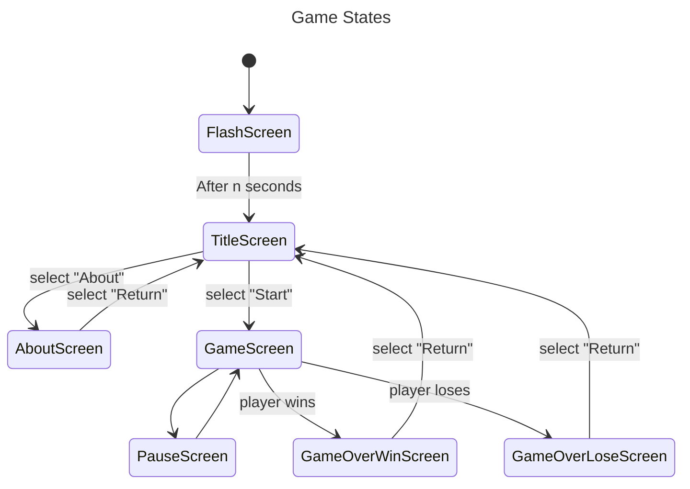

# Day 1

## Jam Goals

### Game Goals

- [ ] Publish a game.
- [ ] That is playable online through the browser.
- [ ] That is complete.

### Mental Health Goals

Also make time to pay attention to mental health issues:

- [ ] Get enough sleep.
- [ ] Do some physical exercise.
- [ ] Spend some family time.

### Process Goals

- [ ] Record reflection at the end of each day

## Inspirations

Have enjoyed playing vampire survivors recently. Mechanics are fairly simple - would like to allow the player a little more control, and probably have fewer enemies with more complex behaviours.

Really like the idea of a challenging task that allows you to upgrade skills between play sessions.

Also enjoyed Doom Eternal, in particular the way enemies are more accurate when the player stops moving.

Also like the idea of allowing for more stealthy paths (like in Dishonoured).

# Theme

## Brainstorming

## Target before bed

- [ ] Set up WASM project (for publication).
- [ ] Set up desktop project (easier to debug).
- [ ] Set up shared library to share between projects.
- [ ] Set up game screens.
- [ ] Set up itch and upload.
- [ ] Make list of game mechanics to implement.

### Set up game screens

